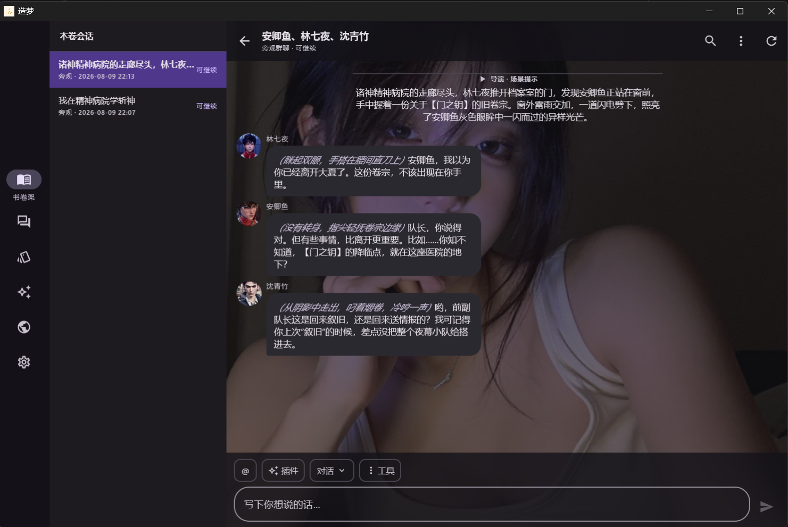

<p align="center">
  
</p>

# 造梦

> “有些角色不是被写完了，只是还没被真正叫醒。”

把中文小说人物蒸馏成可复用的人物包，抽取关系图谱，再让角色按自己的性格、立场、关系和记忆重新开口说话。

[](LICENSE) · [English](README.en.md)

## 项目构成

| 目录 | 说明 | 维护状态 |
| --- | --- | --- |
| [`kmp/`](kmp/README.md) | Compose Multiplatform 客户端：Android / 桌面 / iOS 三端共享 UI，内嵌 Ktor + Room 后端 | ✅ 当前主力 |
| `zaomeng-skill/` | OpenClaw / ClawHub skill 包（命令行 / 代理环境使用） | ✅ 保留 |
| `src/`、`src/web/` | 早期 Python 后端与 Web UI | ⛔ **不再维护**，仅作行为对照与测试基线 |

## 安装

### 客户端

Android APK / 桌面 / iOS 的安装与构建说明见 [`kmp/README.md`](kmp/README.md)。

> ⚠️ 从旧版 Android（1.5.0 及更早）升级到 **2.0.0** 为**阻断性升级**，本地数据不兼容、不会自动迁移；升级前请先在旧版导出书卷包（`.zaomeng-run.zip`）备份。

### skill 包

```bash
# OpenClaw
openclaw skills install wkbin/zaomeng-skill

# ClawHub
npx clawhub@latest install zaomeng-skill

# 本地 skills 目录
python scripts/install_skill.py --skills-dir <你的-skills-根目录>
```

### Web UI（旧版，不再维护，仍可安装使用）

```bash
# 一键安装（Linux / macOS / WSL2 / Termux）
curl -fsSL https://raw.githubusercontent.com/wkbin/zaomeng/main/scripts/install.sh | bash
source ~/.bashrc
zaomeng
```

安装后常用命令：`zaomeng web --reload`（启动 Web UI，访问 `http://127.0.0.1:8000`）、`zaomeng uninstall`、`zaomeng update`。手动方式：`pip install -r requirements.runtime.txt` 后运行 `python scripts/run_webui.py --reload`。依赖：完整开发/测试用 `requirements.txt`，Termux 用 `requirements.termux.txt`（含 `httpx2` 等 Web 测试依赖；EPUB 解析为可选能力）。

## 截图

| 手机端 | 桌面端 |
| --- | --- |
|  |  |

## 社区

- QQ 交流群：**1090225658**

<p>
  
</p>

- 书卷包投稿：[zaomeng-library](https://github.com/wkbin/zaomeng-library/issues)

## 许可证

[AGPL-3.0](LICENSE)
