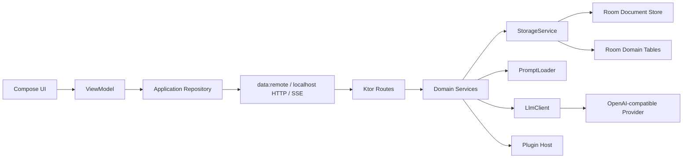

# 系统架构

本文档描述造梦当前 KMP 主实现。旧 Python/Web 目录仅作为行为基线，不属于新功能的目标架构。

## 总览

造梦是本地优先应用：Compose Multiplatform 客户端与内嵌 Ktor 服务运行在同一设备，数据保存在 Room/SQLite 中；只有模型请求、在线书库和显式下载等功能访问外部网络。



## 模块职责

| 模块 | 职责 |
| --- | --- |
| `app/shared` | 共享 UI、导航、ViewModel、展示层 DI 与应用级偏好 |
| `core/contracts` | 跨层 DTO、稳定契约和纯值类型 |
| `core/domain` | 用例与依赖倒置的 Gateway 契约 |
| `core/runtime` | 嵌入式后端、端点与安全存储等运行时抽象 |
| `data/remote` | Ktor API client、SSE、在线书库下载、更新检查、流式文件读写和偏好存储 |
| `data/repository` | 应用 Repository 实现与 domain Gateway 适配 |
| `app/androidApp` | Android 入口、权限、签名与 APK 打包 |
| `app/desktopApp` | Desktop 入口与桌面打包 |
| `server` | 本地 Ktor、业务服务、模型编排、Room 持久化 |
| `plugins-api` | 插件稳定契约 |
| `builtin-plugins` | 官方内置插件 |
| `iosApp` | iOS Xcode 宿主工程 |

共享业务尽量位于 `commonMain`。系统 API、HTTP engine、日志、数据库 builder、ZIP 和平台安全存储等能力通过平台接口隔离。

## 本地请求路径

1. UI 将用户事件交给 ViewModel。
2. ViewModel 生成 operation ID，通过 Repository 请求本地 Ktor。
3. Route 校验 run/session 参数，调用业务 service。
4. Service 读取有界会话上下文、人物资料、世界状态、记忆和原文检索片段。
5. `PromptBuilder` 生成模型消息，`LlmClient` 请求外部 provider。
6. 模型 SSE 被平台 HTTP 实现逐行读取，结构化 delta 由服务端投影为可见对话事件。
7. Route flush 本地 SSE；Repository 解码事件；ViewModel 幂等合并到 UI。
8. 最终结构校验成功后提交 turn 和 session manifest，派生记忆/状态可在后台合并执行。

## 对话流式协议

模型侧多角色协议采用 NDJSON：

```jsonl
{"speaker":"角色甲","message":"第一句。"}
{"speaker":"旁白","message":"门外风声渐紧。"}
```

服务端不等待整份响应结束。当当前行的 `speaker` 已完整且 `message` 开始到达时，增量投影器即可发出可见文字。最终提交仍要求至少存在一条通过 speaker 白名单和字段校验的完整响应。

对外本地 SSE 区分：

- `status`：生成阶段提示；
- `delta`：角色台词、场景或推理增量；
- `reset`：结构失败后重试，客户端清除上一版临时输出；
- `complete`：提交成功，携带轻量 session 和本轮 transcript 增量；
- `failure`：失败信息及可重试标志。

## 提示词与上下文

`DialoguePayloadBuilder` 汇总运行状态，`DialoguePromptBuilder` 负责压缩和分区。上下文主要包括：

- 近期 transcript；
- 参与角色资料和关系；
- scene progress 与世界事实；
- 用户管理的记忆和长期记忆；
- 当前输入及插件增强；
- 原作动态检索出的少量证据。

提示词源位于 `prompts/`，Android 内置副本位于 `kmp/server/src/androidMain/assets/`。两份内容必须同步。

## 原文检索

小说全文和 `original_knowledge.json` 是本地证据库，不会整份发送给模型。系统在本地建立/缓存可检索结构，每轮根据用户输入、角色和场景检索少量条目；PromptBuilder 再限制条目数量和单条长度。

该设计把原文 IO/索引成本与模型 token 成本分离：读取本地文件不消耗模型 token，只有注入提示词的摘录消耗 token。

## 持久化

`StorageService` 提供统一路径与原子读写语义。生产环境由两类 Room 数据共同支撑：

- `documents`：按路径保存 JSON、Markdown、原文、资源等业务文档；
- 领域表：runs、sessions、messages、cards、personas 等，用于索引、列表和分页。

`DomainStore` 在已识别文档写入/删除时同步领域表。任何新增文档类型都要评估是否需要同步规则。

### 会话历史

session manifest 只保留近期 transcript。当条目超过阈值时，旧条目成批移动到 archive 文档，manifest 保存 `transcript_start` 和 `transcript_count`。生成路径读取轻量 manifest；详情和分页路径按需物化完整历史。

### 大型资源

重新蒸馏上传的原文使用内容摘要去重。旧 Web 导出中自带的 Mermaid runtime 不属于关系数据，导入 KMP 时可以丢弃。运行时关系图使用结构化关系资料，而不是为每个 run 保存一份 JS runtime。

## 并发与幂等

- operation ID/turn ID 标识一次用户发送，用于断线恢复和重复请求判断。
- 同一 session 的 manifest 提交受会话级互斥保护。
- 后台状态、世界记忆和长期记忆任务按 session 合并，不能覆盖更新后的前台提交。
- 客户端按 turn ID 合并 complete 增量，避免断线重放造成历史重复。

## 安全边界

- 模型 API key 存在平台安全存储，不进入 Room 文档或导出包。
- ZIP、插件、模型响应、用户文本和路径参数全部视为不可信输入。
- 本地服务只为应用提供接口，不应暴露为公共网络服务。
- 诊断日志只记录截断文本和阶段指标，避免泄露完整原文、对话或密钥。

## 相关决策

- [ADR-0001：本地内嵌 KMP 后端](adr/0001-local-embedded-kmp-backend.md)
- [ADR-0002：多角色对话采用 NDJSON 流式协议](adr/0002-ndjson-dialogue-streaming.md)
- [ADR-0003：会话 transcript 有界清单与分块归档](adr/0003-bounded-transcript-archive.md)
- [ADR-0004：原文使用本地检索摘录](adr/0004-retrieved-source-excerpts.md)
